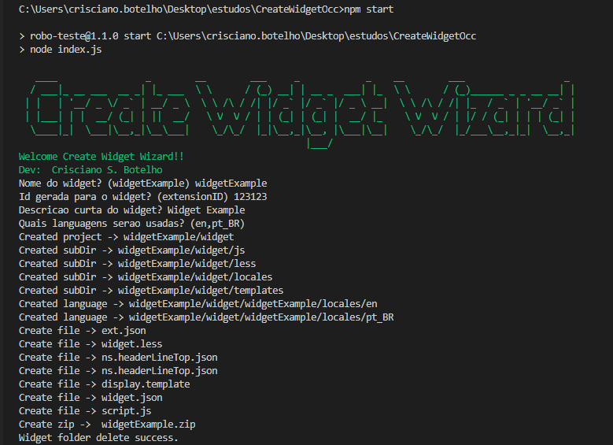

# Create Widget Occ

Create wizard widget Oracle Commerce Cloud.

# Overview
Create structure, create files, zip widget but delete dir.

## Install Dependences

~~~javascript
npm install
~~~
## Start
~~~javascript
npm start
~~~

## Questions

| Question                      | Default       | Example            |
| :----------------             | :-------:     |:---------------    |
| Nome do widget?               | widgetExample | widgetExample      |
| Descrição curta do widget?    | -             | -                  |
| Id gerada para o widget?      | -             | -                  |
| Quais languagens serão usadas?| en,pt_BR      | en,pt,pt_BR,ru,ja  |

## Languagens possibles

| Sigla        | Language                           |
| :------------| :-------                           |
| bg           | Búlgaro                            |
| cs           | Tcheco                             |
| da           | Dinamarquês                        |
| de           | Alemão                             |
| el           | Grego                              |
| en           | Inglês                             |
| en-GB        | Inglês - United Kingdom English    |
| es           | Espanhol                           |
| et           | Estoniano                          |
| fi           | Finlandês                          |
| fr           | Francês                            |
| fr-CA        | Francês                            |
| hr           | Croata                             |
| hu           | Húngaro                            |
| it           | Italiano                           |
| ja           | Japonês                            |
| ko           | Coreano                            |
| lt           | Lituano                            |
| lv           | Letão                              |
| nl           | Holandês                           |
| no           | Norueguês                          |
| pl           | Polonês                            |
| pt           | Português                          |
| pt-BR        | Português - Brasil                 |
| ro           | Romeno                             |
| ru           | Russo                              |
| sh           | Bósnio                             |
| sl           | Esloveno                           |
| sr           | Sérvio                             |
| sr-Latn      | Bósnio                             |
| sv           | Sueco                              |
| th           | Tailandês                          |
| tr           | Turco                              |
| uk           | Ucraniano                          |
| zh-CN        | Chinês                             |
| zh-Hans      | Chinês                             |
| zh-Hant      | Chinês                             |
| zh-TW        | Chinês                             |

## Examples

# V 1.0.3

* Create zip automatic

# V 1.1.0

* Question de languagens
* Create languagens automatic

### References
* [Occ](https://docs.oracle.com/en/)
* [Widget](https://docs.oracle.com/cd/E93106_01/Cloud.18A/WidgetDev/html/s0301createawidget01.html)
* [Node.js](https://nodejs.org)
